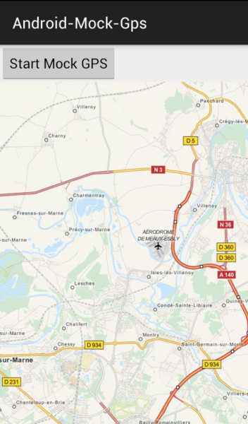
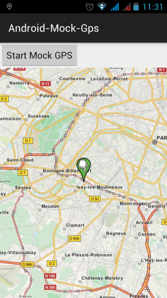
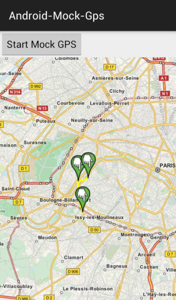
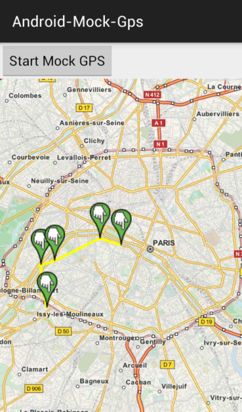
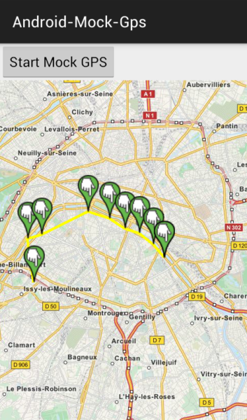
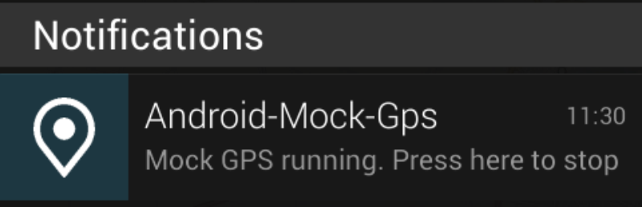

# Android-Mock-Gps

Here is how to set the path, the app will broadcast to the system : 

- [GeolocStore](./src/me/hoen/android_mock_gps/GeolocStore.java)
```java
public class GeolocStore {
    protected ArrayList<Geoloc> data = new ArrayList<Geoloc>();
    
    static public GeolocStore instance = new GeolocStore();
    
    static public GeolocStore getInstance(){
        return instance;
    }
    
    private GeolocStore(){
        //setting latitude, longitude and optionnally altitude and duration
        data.add(new Geoloc(48.830051, 2.281657, 10, 5));
        data.add(new Geoloc(48.849314, 2.277451, 10, 6));
        data.add(new Geoloc(48.851150, 2.286764));
        data.add(new Geoloc(48.861160, 2.317813, 10));
        data.add(new Geoloc(48.858181, 2.332082, 10, 9));
        data.add(new Geoloc(48.853762, 2.342403, 10, 10));
        data.add(new Geoloc(48.851771, 2.352080, 10, 4));
        data.add(new Geoloc(48.846843, 2.361457, 10, 3));
        data.add(new Geoloc(48.841067, 2.368645, 10, 2));
        data.add(new Geoloc(48.841067, 2.368645, 10, 1));
    }
    
    public ArrayList<Geoloc> getGeolocs(){
        return data;
    }
}
```






